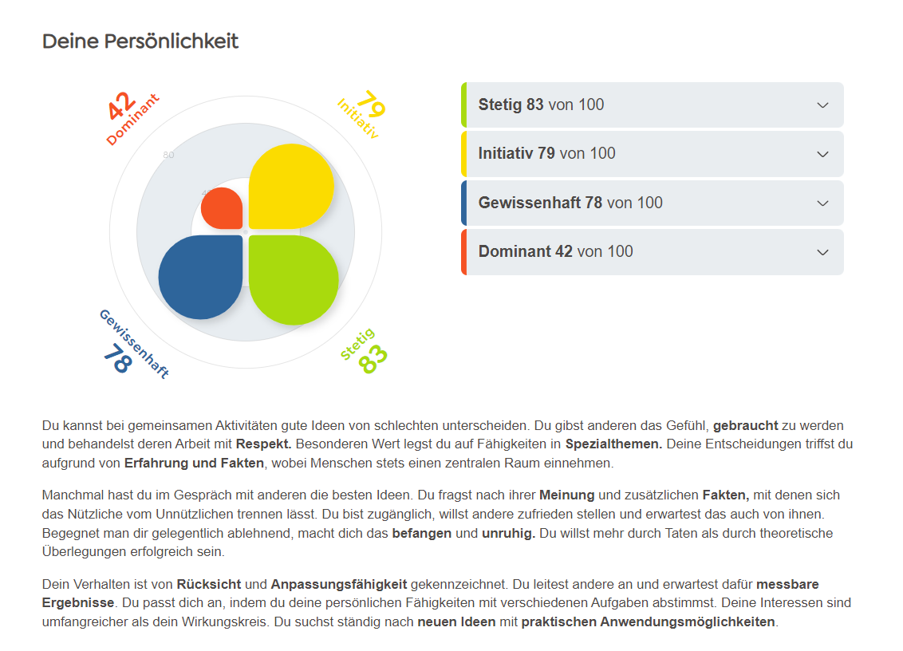

# PE

Auswertungen Persönlichkeitstest

## Woche 1

### Stetig
- Mag gewohnte Abläufe
- Hört gut zu
- Sorgt sich um andere
- Harmonieorientiert

### Initiativ

- Knüpft Kontakte
- Teilt seine Gefühle mit
- Verbindet Menschen
- Steht gerne im Mittelpunkt

### Gewissenhaft

- Sehr zuverlässig
- Denkt die Dinge zu Ende
- Hoher eigener Anspruch
- Datenaffinität

### Dominant

- Trifft schnell Entscheidungen
- Macht sein Ding
- Mag den Wettstreit
- Stellt eigene Regeln auf

## Ablauf Persönlichkeiten erkennen

### Blick
- Augenkontakt

**Dominant:** den anderen fixierend
**Initiative:** alles aufsaugend, interessiert 
**Stetig:** treuherzig, verlässlich
**Gewissenhaft:** nach innen gerichtet

### Mimik
- Reaktion auf Fragen oder Aussagen

**Dominant:** ernst, wenig Bewegung im Gesicht 
**Initiative:** offen, begeistert, auf Empfang gestellt; neugierig 
**Stetig:** mild, häufig wenig Bewegung, sanftes Lächeln 
**Gewissenhaft:** ernst, manchmal fast eingefroren, Mensch gibt nichts von sich Preis 

### Sprache
- Ton
- Geschwindigkeit
- Emotionen

**Dominant:** formal/streng, schnell bis pointiert; bildet sich schnell eine Meinung und äußert sie, wenig: akzentuiert, tief (wichtig): sehr betont, was Stimme mehr Gewicht verleiht 
**Initiative:** informell; leger; zwanglos, tendenziell schnell; bildet sich, schnell eine Meinung; spricht, beim Denken, viel: dramatisierend, sehr lebendig; hell; kann beim Lachen auch sehr hoch sein 
**Stetig:** seriös und freundlich, langsam bis moderat; hoffend, dass jemand zuhört, balanciert, moderat; manchmal, zögerlicher Sprechbeginn 
**Gewissenhaft:** formal/ernst, wenig: wirkt manchmal, emotionslos/ realistische, Darstellung der Fakten, monoton; oft leise

### Gemeinsamkeiten